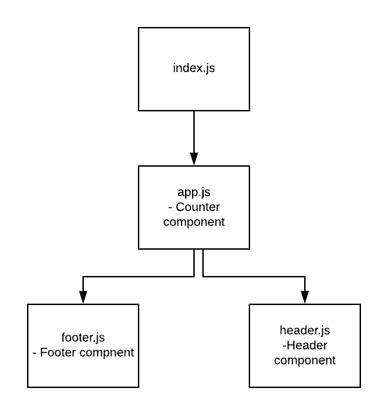

# LAB - 27

 ## react-testing

 ### Author: Evan Brecht-Curry

 ### Links and Resources
* [submission PR](https://github.com/evan-401-advanced-javascript/lab-27-react-testing/pull/1)
* [travis](https://www.travis-ci.com/evan-401-advanced-javascript/lab-27-react-testing)
* [netlify](https://kind-leavitt-e48f4e.netlify.com) 
* [S3](http://lab-27-react-testing-9-17.s3-website-us-west-2.amazonaws.com/) 
* [elastic beanstalk](https://lab27.du85ci9nuqg3t.amplifyapp.com/) 
* [docs]( http://localhost:6060/)

part 1 - https://codesandbox.io/embed/28-starter-code-props-d9zs1

part 2 - https://codesandbox.io/embed/28-starter-code-internal-state-zg6f8

part 3 - https://codesandbox.io/embed/28-starter-code-internal-state-x46rv

##Note
* Spoke with Kris and Venicio and due to confusing instruction I completed part 3 in trying to do part 2. 

 ##### Exported Values and Methods

### Setup
npm run styleguidist

#### `.env` requirements

 #### UML
